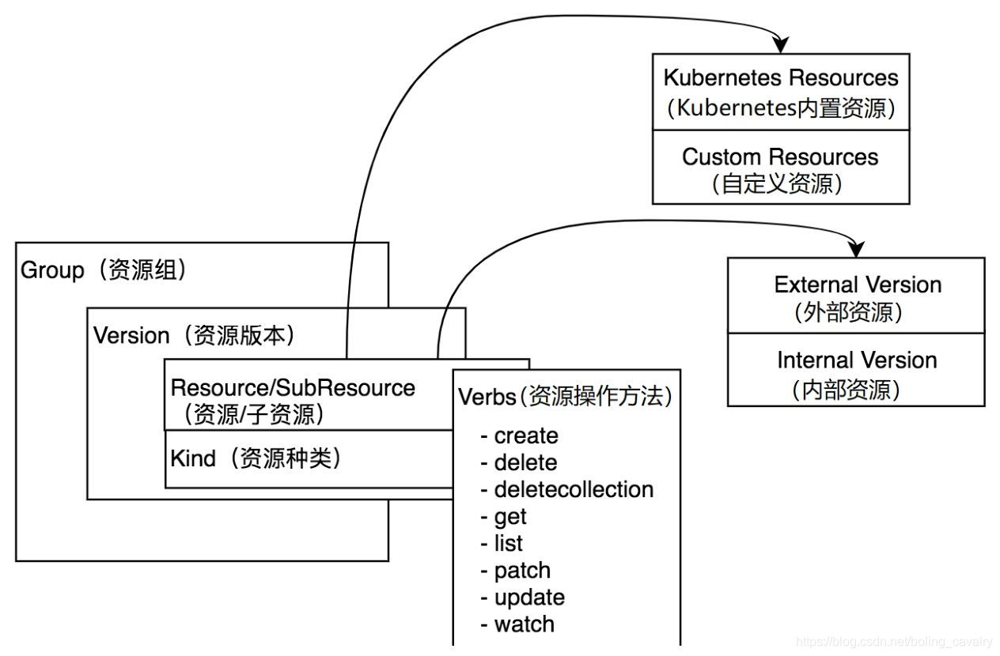

# client-go-demo

## Group、version、Resource




### Gruop

1. Group 即资源组，在 kubernetes 对资源进行分组时，对应的数据结构就是 Group。
2. 在 kubernetes 中有两种资源组：**有组名资源组**和**无组名资源组**。
3. Deployment 有组名，pod 没有组名。

### Version

* Version 即版本。
  * Alpha：内部测试版本，如v1alpha1
  * Beta：经历官方和社区测试的相对稳定版本，如v1beta1
  * Stable：正式发布版，如v1、v2

### Resource

* 常见的pod、service、deployment这些都是资源

  * 在 kubernetes 环境被实例化的资源即资源对象(ResourceObject)
  * 资源被分为持久性（Persistent Entity）和非持久性（Ephemeral Entity），持久性如 deployment，创建后会在 etcd 保存，非持久性如 pod

* kubernetes为资源准备了8种操作：create、delete、deletecollection、get、list、patch、update、watch，每一种资源都支持其中的一部分，这在每个资源的API文档中可以看到

* 资源支持以命名空间（namespace）进行隔

* 资源对象描述文件在日常操作中频繁用到，一共由五部分组成：apiVersion、kind、metadata、spec、status

  ```yaml
  apiVersion: apps/v1  # 资源组和版本
  kind: Deployment	# 资源对象的种类
  metadata:	# 元数据，如名称和命名空间
    name: nginx
    namespace: dev
  spec:	# 该资源对象的核心信息，如镜像、副本数
    replicas: 3
    selector:
      matchLabels:
        run: nginx
    template:
      metadata:
        labels:
          run: nginx
      spec:
        containers:
        - image: nginx:1.17.1
          imagePullPolicy: IfNotPresent
          name: pod
          ports:
          - name: nginx-port
            containerPort: 80
            protocol: TCP
  ```


### 官方文档速查

地址 [kubernetest-api](https://v1-23.docs.kubernetes.io/docs/reference/generated/kubernetes-api/v1.23/)


### 实际操作

* 查看所有资源 **kubectl api-resources -o wide**，可见当前环境的所有资源，及其相关属性
* 只看 apps 这个 group 下面的资源 **kubectl api-resources --api-group apps -o wide**
* 查看指定资源的详情 **kubectl explain configmap**
* 查看所有 a 和 Version 的命令 **kubectl api-versions**


### 

## client 类型

* RESTClient：最基本的客户端，提供最基本的封装
* Clientset：是一个 Client 的集合，在 Clientsset  中包含了所有 k8s 内置资源的 Client，通过 Clientset 中包含了所有 k8s 内置的资源的 client，通过 Clientset 便可以很方便的操作 pod, service 这些资源
* dynamicClient：动态客户端，可以操作任意资源 k8s 的资源，包括 CRD定义的资源
* DiscoveryClient：用于发现 k8s 提供的资源组、资源版本和资源信息，比如：kubectl api-resources

### RESTClient 的使用

* RESTClientFor ： 为创建 RESTClient 准备 config，比如限速器、编解码
* UnversionedRESTClientFor ：与 RESTClientFor 类似，只是允许 config.Version 为空

### 基本步骤

1. 确定要操作的资源类型，去官方 API 文档中找到对于的 path、数据结构等信息；
2. 加载配置 kubernetes 配置文件（和 kubectl 使用的 kubeconfig 完全相同）；
3. 根据配置文件生成配置对象，并且通过 API 对配置对象进行设置（如请求的 path、Group、Version、序列化反序列化工具）；
4. 创建 RESTClient 实例，入参数配置对象；
5. 调用 RESTClient 实例的方法向 kubernetes 的 API Server 发起请求，编码用 fluent 风格将各种参数传入（如指定的 namespace、资源等）,如果是查询类请求，还要传入数据结构实例的指针，该数据结构用于接受 kubernetes 返回查询结果

### Clientset


## Reflector 原理


### Reflector 的创建

```go
func NewReflector(lw ListerWatcher, expectedType interface{}, store Store, resyncPeriod time.Duration) *Reflector {
	...
}
```

参数说明：

* Lw  : interface，包含了 interface Lister 和 watcher。通过 ListerWatcher 获取初始化指定资源的列表和监听指定资源变化
* expectedType: 指定资源类型
* Store: 指定存储，需要实现 store 这个 interface
* resyncPeriod: 同步周期

### List 与 watch

保证可靠性、实时性和顺序性

* List: 指定类型资源对象的全量更新。并将其更新到缓存当中

  ```powershell
  curl -iv http:127.0.0.1:8001/api/v1/namespaces/{namespaces}/pods
  ```

* Watch: 指定类型资源对象的增量更新

  ```powershell
  curl -iv http:127.0.0.1:8001/api/v1/namespaces/{namespaces}/pods\?watch\=true
  ```

操作：

```powershell
# 打开代理
kubectle proxy
# 通过 localhost:8001去访问
curl http:127.0.0.1:8001/api/v1/namespaces/default/pods
# 修改 pod 里面的资源
kubectl edit pod pod-name
```

### ResourceVersion 与 Bookmarks

* resourceVersion
  * 保证客户端数据一致性和顺序性
  * 并发控制
* bookmarks
  * 减少 API Server 负载
  * 更新客户端保存的最近一次 resourceVersion

